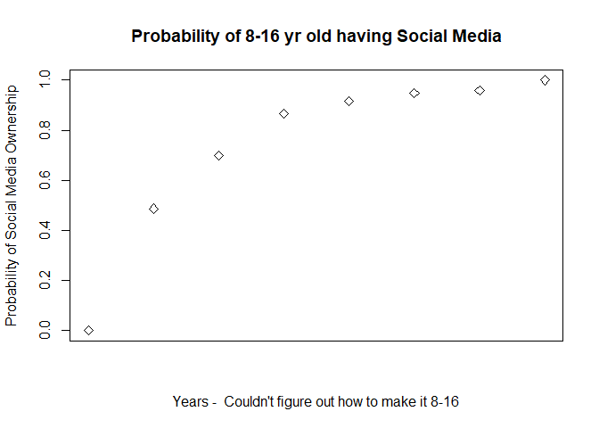

Test statistical assignment
================
Daniel Orchard
22 January 2020

## Introduction

Please change the author and date fields above as appropriate. Do not
change the output format. Once you have completed the assignment you
want to knit your document into a markdown document in the
“github\_document” format and then commit both the .Rmd and .md files
(and all the associated files with graphs) to your private assignment
repository on Github.

## Reading data (40 points)

``` r
suppressMessages(library(dplyr))
```

    ## Warning: package 'dplyr' was built under R version 3.5.3

``` r
suppressMessages(library(readr))
```

    ## Warning: package 'readr' was built under R version 3.5.3

``` r
suppressMessages(library(tidyverse))
```

    ## Warning: package 'tidyverse' was built under R version 3.5.3

    ## Warning: package 'ggplot2' was built under R version 3.5.3

    ## Warning: package 'tibble' was built under R version 3.5.3

    ## Warning: package 'tidyr' was built under R version 3.5.3

    ## Warning: package 'purrr' was built under R version 3.5.3

    ## Warning: package 'stringr' was built under R version 3.5.3

    ## Warning: package 'forcats' was built under R version 3.5.3

``` r
# This attaches the tidyverse package. If you get an error here you need to install the package first. 
data <- read_tsv("C:/Users/dan19/Documents/MY DOCUMENTS/Year 2 Term 2 Modules/Data III/Understanding Society Data/UKDA-6614-tab/tab/ukhls_w9/i_youth.tab")
```

    ## Parsed with column specification:
    ## cols(
    ##   .default = col_double()
    ## )

    ## See spec(...) for full column specifications.

``` r
# You need to add between the quotation marks a full path to the required file on your computer.
```

## Tabulate variables (10 points)

In the survey children were asked the following question: “Do you have a
social media profile or account on any sites or apps?”. In this
assignment we want to explore how the probability of having an account
on social media depends on children’s age and gender.

Tabulate three variables: children’s gender, age (please use derived
variables) and having an account on social media.

``` r
table(data$i_ypsocweb)
```

    ## 
    ##   -9    1    2 
    ##   14 2277  530

``` r
table(data$i_age_dv)
```

    ## 
    ##   9  10  11  12  13  14  15  16 
    ##   1 460 496 467 463 491 434   9

``` r
table(data$i_sex_dv)
```

    ## 
    ##    0    1    2 
    ##    2 1411 1408

## Recode variables (10 points)

We want to create a new binary variable for having an account on social
media so that 1 means “yes”, 0 means “no”, and all missing values are
coded as NA. We also want to recode gender into a new variable with the
values “male” and “female” (this can be a character vector or a factor).

``` r
data$socialmedia <- NA

data$socialmedia[data$i_ypsocweb == "1"] <- 1
data$socialmedia[data$i_ypsocweb == "2"] <- 0

table(data$i_ypsocweb)
```

    ## 
    ##   -9    1    2 
    ##   14 2277  530

``` r
table(data$socialmedia)
```

    ## 
    ##    0    1 
    ##  530 2277

``` r
mean(data$socialmedia, na.rm = TRUE)
```

    ## [1] 0.8111863

## Calculate means (10 points)

Produce code that calculates probabilities of having an account on
social media (i.e. the mean of your new binary variable produced in the
previous problem) by age and gender.

``` r
tapply(data$socialmedia, data$i_sex_dv, mean, na.rm = TRUE)
```

    ##         0         1         2 
    ## 1.0000000 0.7826087 0.8395150

``` r
# 1 is male, 2 is female, 0 is inconsistent

tapply(data$socialmedia, data$i_age_dv, mean, na.rm = TRUE)
```

    ##         9        10        11        12        13        14        15        16 
    ## 0.0000000 0.4868996 0.6989899 0.8655098 0.9152174 0.9468303 0.9585253 1.0000000

``` r
plotdata <- tapply(data$socialmedia, data$i_age_dv, mean, na.rm = TRUE)
## seems to show that 0 percent of 9 years olds have a social media account and 100% of 16 year olds do. This seems quite unlikely. Other than that the probability of having a social media account rises dramatically from 10 to 12 and then stays in the 90% region.
```

## Write short interpretation (10 points)

This data seems to show that 0 percent of 9 years olds have a social
media account and 100% of 16 year olds do. This seems quite unlikely.
Other than that the probability of having a social media account rises
dramatically from 10 to 12 and then plateaus in the 90% region.

## Visualise results (20 points)

Create a statistical graph (only one, but it can be faceted)
illustrating your results (i.e. showing how the probability of having an
account on social media changes with age and gender). Which type of
statistical graph would be most appropriate for this?

``` r
# 
library(ggplot2)

labels <- c(8:16)

plot(plotdata, xlab = "Years -  Couldn't figure out how to make it 8-16", 
               ylab = "Probability of Social Media Ownership",
               pch = 5,
               main = "Probability of 8-16 yr old having Social Media",
               xaxt="n"               )
```

<!-- -->
\#axis(1, at= c(1:8),labels= c(8:16), col.axis=“red”, las=2 \#wanted to
use this to make new ticks on the x axis. wouldnt work :(

## Conclusion

This is a test formative assignment and the mark will not count towards
your final mark. If you cannot answer any of the questions above this is
fine – we are just starting this module\! However, please do submit this
assignment in any case to make sure that you understand the procedure,
that it works correctly and you do not have any problems with summative
assignments later.
